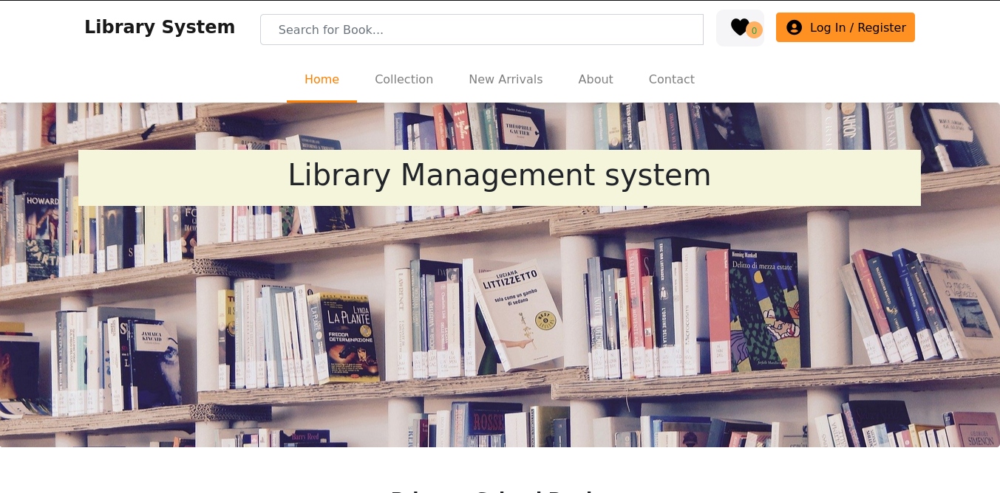

## __Library Management Application__ [Software Eng Project]

### Designed By
  > [ochen.hillary](https://github.com/occn8)
  

### Running Project
* [x] __Make sure__ xampp or `any-other` is started or running
* [x] __Move__ the project folder(__libsystem__) to location 'PWD'/lampp/htdocs/
* [x] __Then__ Paste this URL __`http://localhost/libsystem/index.php`__ to your browser
* [x] __Done__

### Screenshots
__`Home screen`__

